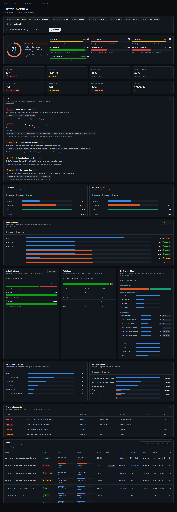
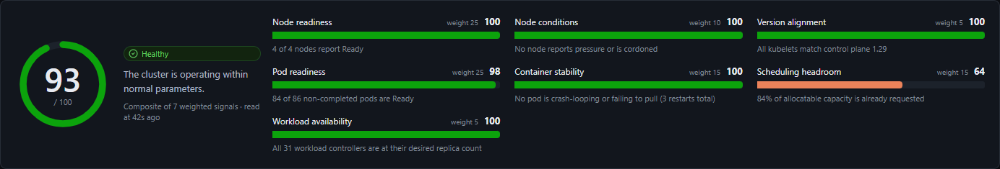
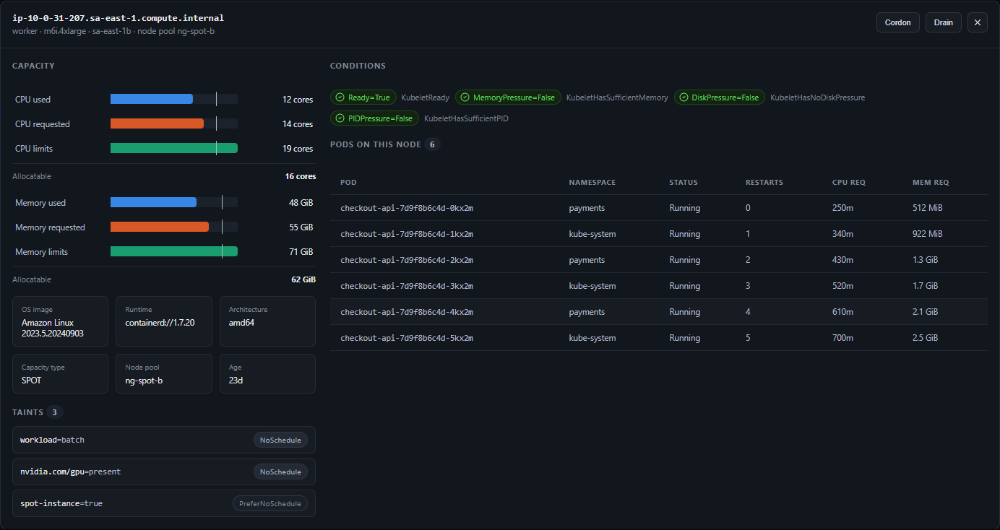

<div align="center">

# 🦈 tmjLens

**A Kubernetes operations console that tells you what is wrong — not just what exists.**

Cross-cloud cluster health, real capacity accounting, and RBAC-safe operations
in a native desktop app that stores none of your credentials.

`Tauri 2` · `Rust` · `React` · `TypeScript`

[](LICENSE)


</div>



---

## Why another Kubernetes UI

Most Kubernetes dashboards are object browsers. They render the same lists `kubectl get`
already gives you, and leave the actual diagnosis to you.

That is fine until something breaks. Then the questions are never "what pods exist" —
they are *why is this pod Pending*, *which node is about to evict things*, *did we
actually run out of capacity or did someone just over-request*, and *am I allowed to
fix it*.

tmjLens is built around those questions.

## What it does

### Cluster health, scored and explained

A single composite score built from seven weighted signals — node readiness, node
conditions, pod readiness, container stability, scheduling headroom, version alignment,
and workload availability. Every signal shows its own score, its weight, and the
evidence behind it.



Below the score sit **findings**: concrete, evidence-backed statements with the affected
resources and a next step. Nothing is asserted without a source signal — if a collector
was denied by RBAC or `metrics-server` is absent, the overview says so instead of
quietly showing zeros.

### Capacity the way the scheduler sees it

The reason pods go Pending is almost never live CPU usage — it is **requests**, which
reserve capacity whether or not anything consumes it. tmjLens plots allocatable,
requested, limits, and live usage on one axis, per cluster and per node, and marks
where limits cross allocatable so overcommit is visible at a glance.

Requests are computed with the real Kubernetes rule, including init containers competing
for the maximum and sidecars adding to the sum.

### Multi-cloud with no configuration

Point it at any cluster. tmjLens detects **EKS, AKS, GKE, or plain Kubernetes** from
`spec.providerID`, node labels, and the API endpoint, then normalises each provider's
node-pool and Spot labels into one shape:

| | EKS | AKS | GKE |
|---|---|---|---|
| Node pool | `eks.amazonaws.com/nodegroup`, `karpenter.sh/nodepool` | `kubernetes.azure.com/agentpool` | `cloud.google.com/gke-nodepool` |
| Spot | `eks.amazonaws.com/capacityType` | `kubernetes.azure.com/scalesetpriority` | `cloud.google.com/gke-spot` |

Cloud SDK calls are strictly additive. Without cloud credentials you lose the control
plane's platform version and OIDC issuer — nothing else.

### Node detail that answers scheduling questions

Conditions, taints with their effects, capacity, and every pod on the node.



### Operations gated by Kubernetes, not by the UI

Cordon, drain, delete, scale, rollout restart, and YAML apply are all checked against
`SelfSubjectAccessReview` before the button appears — and Kubernetes remains the
authority regardless. There is no client-side permission model to bypass.

## Status

Version `0.1` — the Kubernetes core and the cluster overview are usable; the rest is
scaffolding. This table is the honest state, not the roadmap.

| Area | State |
|---|---|
| Kubeconfig contexts, namespaces, pods, deployments, events | ✅ Working |
| Bounded pod logs, container selection, log export | ✅ Working |
| Cluster overview: health, capacity, distribution, findings | ✅ Working |
| Provider detection (EKS / AKS / GKE / generic) | ✅ Working |
| Node operations (cordon, drain, delete) with RBAC gating | ✅ Working |
| Workload operations (scale, rollout restart, delete) | ✅ Working |
| YAML view and server-side apply (Pods, Deployments) | ✅ Working |
| Live log follow (cancellable streams) | ✅ Working |
| Live pod watch, port-forward, container exec | ✅ Working |
| Resource relation graph, command palette, global search | ✅ Working |
| Network: services, endpoints, ingresses, classes, policies | ✅ Working |
| Velero: backups, restores, schedules, storage locations | ✅ Working |
| Configuration: maps, secrets, quotas, budgets, admission webhooks | ✅ Working |
| Storage: claims, volumes, classes, and what is provisioned but idle | ✅ Working |
| Namespaces, including ones stuck Terminating and why | ✅ Working |
| Deploy report: what landed today, per namespace, on demand | ✅ Working |
| Executive PDF report, environment marking (prod/staging) | ✅ Working |
| EC2 correlation, load balancer and storage context | 🚧 Planned |
| Plugin SDK (Helm, Argo CD, Vault, Prometheus, Grafana) | 🚧 Planned |


See [docs/ROADMAP.md](docs/ROADMAP.md) for the full plan.

## Security posture

- **No credential storage.** tmjLens never writes Kubernetes tokens, cloud credentials,
  or Secret values to disk. It uses your existing kubeconfig and your cloud provider's
  own credential chain. When a cloud session expires, the app says so and points you at
  your provider's CLI, because the sign-in can only happen there.
- **Secrets stay in the cluster.** The Configuration screen lists secret key names and
  sizes but carries no values. A value is read only when you ask for that one key, and
  the screen has no export — a Secret written to a file is a credential in the clear.
- **No object storage access.** The Velero screen reads Velero's own custom resources
  through the Kubernetes API. tmjLens holds no S3, Blob or GCS credential; the bucket is
  reached by Velero, not by this app.
- **Kubernetes RBAC is the only authority.** The UI hides actions it knows are
  unauthorized, but never grants anything; a `403` is handled as an expected state.
- **Secret values are hidden by default**, even when technically readable.
- **Destructive actions require explicit confirmation.**
- **The UI has no filesystem permission.** The webview is granted `core:default` and
  nothing else — no `fs`, no `dialog`. Log exports go through a single Rust command
  that writes into your Downloads folder and strips any path component from the file
  name, so the frontend can never choose where a file lands.
- **No telemetry.** None, in any build.

> **Not yet production-hardened.** This is a `0.1`. It has not had an independent
> security review, and the Tauri CSP is currently disabled (`"csp": null` in
> [src-tauri/tauri.conf.json](src-tauri/tauri.conf.json)) — tightening that is tracked
> for `v1.0`. Treat it accordingly on clusters that matter.

## Quick start

Prerequisites: [Rust](https://rustup.rs/), [Node.js 20+](https://nodejs.org/), and the
Tauri CLI (`cargo install tauri-cli`). Plus a working `kubectl` context.

```bash
cd src && npm install
cd ../src-tauri && cargo tauri dev
```

Build a release binary:

```bash
cd src-tauri && cargo tauri build
```

The executable lands in `src-tauri/target/release/`. Full prerequisites, kubeconfig
notes, and troubleshooting are in [CONTRIBUTING.md](CONTRIBUTING.md).

## Development

The visual layer runs against fixtures, so you can iterate on it without a cluster:

```bash
cd src && npm run dev
# then open http://localhost:5173/preview.html
```

| URL | Renders |
|---|---|
| `/preview.html` | Cluster overview, EKS fixture with full cloud enrichment |
| `/preview.html?provider=aks` | The same page with no cloud enrichment and no metrics-server |
| `/preview.html?view=actions` | Row action menu inside a clipping panel |

The fixtures deliberately cover the awkward cases: an unready node, memory and disk
pressure, a cordon, kubelet version skew, overcommitted limits, multiple taints, and
long resource names.

```bash
cd src-tauri && cargo test    # Rust unit tests
cd src && npm run build       # type-check and bundle
cd src && npm run test:e2e    # Playwright regression tests
```

## Architecture

```text
React + TypeScript UI
        │  Tauri commands (typed, async)
        ▼
Rust application layer
  ├── kube client — contexts, resources, logs, SelfSubjectAccessReview
  ├── cluster overview — provider detection, capacity model, health, findings
  └── cloud context — optional, read-only enrichment
```

The frontend never talks to Kubernetes directly and holds no filesystem permission —
every cluster call and every disk write goes through a typed Rust command. Layer
details are in [CONTRIBUTING.md](CONTRIBUTING.md); product direction is in
[docs/ROADMAP.md](docs/ROADMAP.md).

## Contributing

Issues and pull requests are welcome. Please read [AGENTS.md](AGENTS.md) first — it
documents the engineering rules this codebase holds to, particularly around credential
handling, RBAC, and never performing destructive operations silently.

## License

Copyright © 2026 Thiago Mattar Jacometti.

Licensed under the **GNU Affero General Public License v3.0** — see [LICENSE](LICENSE).

In practice: fork it, run it, modify it freely. But if you distribute a modified
version — **or run one as a network service** — you must publish your source under the
same license. The AGPL's network clause is deliberate: it is what stops tmjLens from
being turned into a closed hosted product.

Commercial licensing on different terms is available from the copyright holder.
