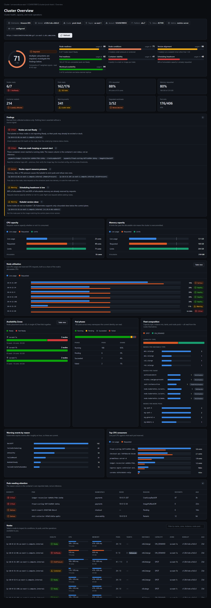

<div align="center">

# 🦈 tmjLens

**A Kubernetes operations console that tells you what is wrong — not just what exists.**

Install it with Helm. Sign in with Azure AD or generic OIDC. It runs in the cluster it manages —
one instance, one cluster, shared over Ingress.

[](LICENSE)


</div>



---

You need **Helm**, **kubectl**, and an **identity provider** (Azure AD, or any OIDC issuer). You do not need this
repository, Rust, Node, or a development machine. Helm pulls the chart and the
image from GHCR; the only file you write is values.

## What it does

Health score with evidence, capacity the way the scheduler sees it (requests,
not live usage), workloads, logs, rollout restart, network, storage,
configuration, namespaces, Helm, Velero, Argo, Kyverno, reports. Admins also
get **Rightsizing** (request vs real usage from a node DaemonSet) and, when
`hpaManager.enabled` is on, applying HorizontalPodAutoscalers.

If something could not be collected, the overview says so instead of showing a
quiet zero.

## Who may do what

The pod's ServiceAccount is `cluster-admin` so the console can act. Who may use
each action is decided after SSO login, by three fixed profiles:

| Profile | Who gets it | Can |
|---|---|---|
| **Admin** | The email in `bootstrapAdmin` | Everything, including Access and Rightsizing |
| **Developer** | Granted later by an admin | Cluster Overview, workloads, pod logs, rollout restart |
| **Guest** | Everyone else's first sign-in | Cluster Overview only |

Developer cannot scale, delete a deploy, or port-forward, and cannot see
Rightsizing (reads return `403` as well). Nodes, Reports, Cloud and Plugins stay
off that nav.

Settings → Clusters is read-only. Cluster name and environment are set at
install and cannot be changed in the UI.

## Install

### 1. Identity (Azure AD or generic OIDC)

Register a **Web** application. Redirect URI:

```text
https://tmjlens.example.com/auth/callback
```

Use the same host as `ingress.host` below. Allow `openid`, `profile` and
`email`. Copy tenant id, client id and client secret into the values file.

If you are not using Ingress yet, set `azure.redirectUrl` to the URL that
actually reaches `/auth/callback`.

For an issuer that is not Azure AD (Cognito, Keycloak, Google, …), leave `azure.*`
empty and set:

```yaml
oidc:
  issuer: https://your-issuer.example
  clientId: "..."
  clientSecret: "..."
  emailClaim: email
```

The chart then uses OIDC discovery (`/.well-known/openid-configuration`).

### 2. Values file

On the machine that runs Helm, save this as `values.install.yaml` and replace
every field. Do not commit it — it holds the Azure secret.

```yaml
image:
  repository: ghcr.io/tmjacometti/tmjlens
  tag: "0.6.5"
  pullPolicy: IfNotPresent

environment:
  cluster: prod-shark          # label shown in the UI
  type: production             # must be exactly: production | staging | development

# Case does not matter. ADMIN@EMPRESA.COM.BR still matches.
bootstrapAdmin: admin@tmjsistemas.com.br

azure:
  tenantId: "00000000-0000-0000-0000-000000000000"
  clientId: "00000000-0000-0000-0000-000000000000"
  clientSecret: "replace-me"
  redirectUrl: ""              # empty → https://<ingress.host>/auth/callback

service:
  type: ClusterIP
  port: 80

ingress:
  enabled: true
  className: nginx
  host: tmjlens.example.com
  annotations:
    nginx.ingress.kubernetes.io/proxy-read-timeout: "3600"
    nginx.ingress.kubernetes.io/proxy-send-timeout: "3600"
  tls:
    - secretName: tmjlens-tls
      hosts:
        - tmjlens.example.com

persistence:
  enabled: true
  size: 10Gi
  storageClass: ebs-csi-sc     # kubectl get storageclass — skip only if one is default
```

`environment.type` must be one of those three words. `prd`, `hml` and `dev`
are rejected.

If Ingress is on, you need an ingress controller and a TLS secret named
`tmjlens-tls` in the `tmjlens` namespace — or drop the `tls:` block until you
have a certificate.

### 3. Helm

A release is a `v*` tag; each publishes the image and the chart. After this
version is tagged **v0.6.5**, install it:

```bash
helm upgrade --install tmjlens oci://ghcr.io/tmjacometti/tmjlens-chart \
  --version 0.6.5 \
  -n tmjlens --create-namespace \
  -f values.install.yaml
```

If the OCI registry still asks for login, use the GitHub Release asset (always
public, same file):

```bash
helm upgrade --install tmjlens \
  https://github.com/TMJacometti/tmjlens/releases/download/v0.6.5/tmjlens-chart-0.6.5.tgz \
  -n tmjlens --create-namespace \
  -f values.install.yaml
```

```bash
helm show values oci://ghcr.io/tmjacometti/tmjlens-chart --version 0.6.5
```

### 4. What you get

In namespace `tmjlens`:

| Resource | Notes |
|---|---|
| Deployment, **1 replica** | Do not scale. The database is a file on the disk; login sessions live in that one process. |
| DaemonSet collector | Scrapes this node's kubelet; POSTs rollups to the web Service. Never mounts the PVC. |
| PVC 10Gi | Survives pod restarts. `helm uninstall` deletes it. |
| Service port 80 (`http`) | Target for Ingress |
| Ingress | `https://tmjlens.example.com` |
| Secret | Identity-provider credentials and the ingest token |
| ServiceAccount + `cluster-admin` | The ceiling. Profiles are the gate. |

Without Ingress:

```bash
kubectl -n tmjlens port-forward svc/tmjlens 8080:80
```

Then set `azure.redirectUrl` to whatever URL the browser uses for
`/auth/callback` (for port-forward, that is not the in-cluster Service DNS).

### 5. First login

Open the host and sign in with the identity provider you configured.

- `bootstrapAdmin` becomes **admin** (case and spaces around the address are ignored).
- Everyone else starts as **guest**. An admin promotes people under Access.

A DaemonSet (`*-collector`) scrapes this node's kubelet `/metrics/cadvisor` and
POSTs 5-minute rollups to the web Service. It does not mount the PVC; only the
single web replica writes tmjLite. Fargate / virtual nodes have no kubelet the
DaemonSet can reach — those workloads show as limited data.

`hpaManager.enabled` defaults to false. Turning it on lets Admin preview and
apply HPAs (`autoscaling/v2`, field manager `tmjlens`). Developer and Guest get
`403` on those endpoints.

## Security

- Login is Azure AD or generic OIDC. There is no password stored in tmjLens.
- The UI never grants access. A denied action is a visible `403`.
- Destructive actions ask for confirmation.
- Secret values stay hidden by default.
- No telemetry.
- One replica only. The collector DaemonSet is a separate process and never
  opens the database.

This is a `0.6` MVP. It has not had an independent security review. Treat it
accordingly on clusters that matter.

## License

Copyright © 2026 Thiago Mattar Jacometti.

Licensed under the **GNU Affero General Public License v3.0** — see [LICENSE](LICENSE).

If you run a modified tmjLens as a network service, you must publish that
source under the same license.

Commercial licensing on different terms is available from the copyright holder.

---

To **clone this repository and change the code**, read
[CONTRIBUTING.md](CONTRIBUTING.md) first. That is the development setup (Rust,
Node, tests). This README is only the Helm install.
