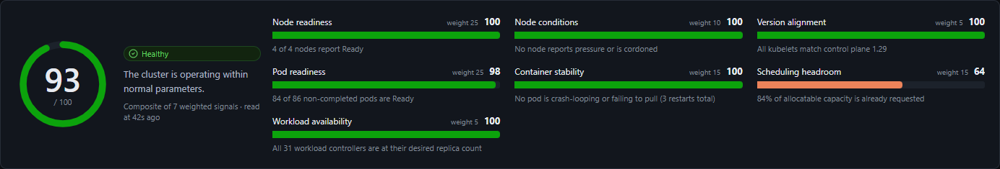
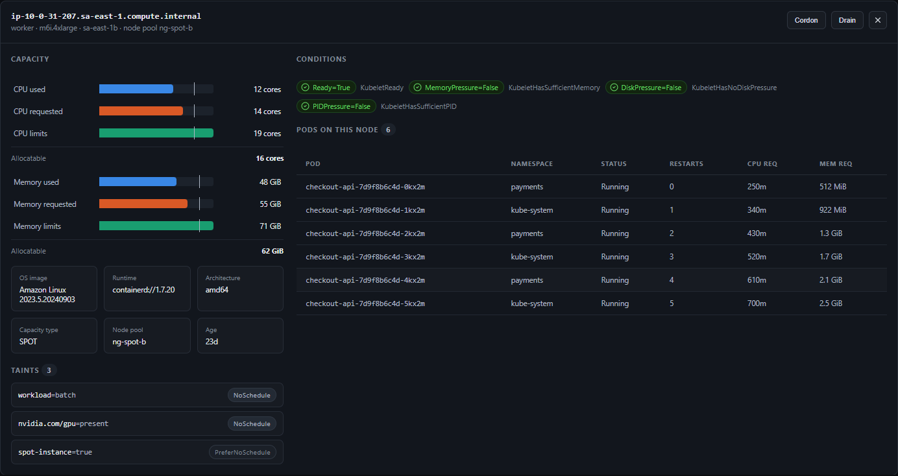

<div align="center">

# 🦈 tmjLens

**The Kubernetes console that tells you what is wrong, what it costs, and fixes it — from one screen.**

One Helm install. Sign in with your company login. Your whole team sees the same cluster, each person with exactly the permissions you gave them.

[](LICENSE)


[Install in 10 minutes](CONTRIBUTING.md#installing-on-a-cluster-helm) · [What's on the roadmap](docs/ROADMAP.md) · [Contribute](CONTRIBUTING.md)

</div>


---

## Why teams pick tmjLens

**Most Kubernetes dashboards show you *what exists*.** Pods, nodes, services, a wall of green.
When something breaks you still open a terminal and start typing `kubectl describe`.

tmjLens starts from the other end. It opens with a **health score and the evidence behind it**:
which deployments are below desired, which pods are crash-looping, which nodes are full,
which services have nothing ready behind them — in words, with the reason, ready to act on.

And when the answer is "we could not collect this", it **says so**. Never a quiet zero that
looks like good news.

## What you get

### 💸 Rightsizing — see the waste, apply the fix

Most clusters pay for CPU and memory that nobody uses. tmjLens runs a lightweight collector on
every node, measures what each container *really* consumes, and puts it beside what it *asks for*.

- **Waste in dollars per month**, sorted biggest-first, filtered by namespace.
- **An explainable recommendation** for every container — p95 CPU plus headroom, peak memory
  plus headroom, with a confidence level that grows as data accumulates.
- **Apply it without leaving the screen.** Preview the exact diff, then apply. Set the new
  requests and limits directly, or create a HorizontalPodAutoscaler — your choice.
- **Always the live numbers.** The screen reads the workload as the cluster holds it right
  now, so an edit made by you, by `kubectl` or by Helm shows up on the next refresh.
- **Undo.** tmjLens remembers what was there before it touched anything.
- **Honest about ownership.** If Helm, Argo CD or Flux manages those fields, tmjLens warns you
  before it changes them.

### 🩺 Health, not just inventory

- **Cluster Overview** with a health score, findings in plain language, and the objects behind
  each one.
- **Capacity the way the scheduler sees it** — requests, not usage — so you know *why* a pod
  stays Pending.
- **Workloads, logs, events, relations.** Click a pod or a deployment and its full detail opens
  over the list: logs that follow, live CPU and memory, a shell, port-forward, the YAML, and a
  relation graph that shows the Ingress → Service → Pod → ConfigMap chain, with the broken link
  highlighted.
- **Network, storage, configuration, namespaces, nodes** — each with its own findings, not just
  a table.

### 🔌 The tools you already run, in the same place

| Plugin | What it gives you |
|---|---|
| **Helm** | Releases, history, the failed hook named. Uninstall and rollback from the UI. |
| **Velero** | Backups and restores from the cluster's own records — no bucket credentials needed. |
| **Argo Workflows** | Workflows, cron workflows and templates; submit, stop, change image, schedule, resources. |
| **Kyverno** | Policies joined with their reports — see what is *enforced* vs merely *audited*, and flip it. |
| **Reports** | What changed, who changed it, and what is unhealthy — exportable. |

### 🔐 Built for a team, not a laptop

- **One install per cluster**, shared over your Ingress. No kubeconfigs on laptops, no VPN
  gymnastics.
- **Sign in with Azure AD or any OIDC provider.** tmjLens stores no passwords. Ever.
- **Three profiles — Admin, Developer, Guest.** New sign-ins start as Guest and see the overview
  only. Admins promote people from the Access screen.
- **The server decides, every time.** A denied action is a visible `403`, never a hidden button.
  Every action — allowed or denied — is recorded under the person's own name, not the
  ServiceAccount's.
- **Production awareness.** Mark a cluster `production` and the console tightens what
  Developers may do and warns before anything with blast radius.
- **No telemetry, no phone-home, no SaaS.** Your cluster data stays in your cluster.

## New in 0.7

- **Rightsizing reads the live request.** Edits — yours, `kubectl`'s or Helm's — show on the
  next refresh. Workloads that left the cluster are marked as history.
- **Sort and filter.** Columns sort (waste biggest-first by default) and a namespace filter
  narrows the list.
- **Preview is the review.** For HPAs and for resources alike, Preview opens the diff and Apply
  lives inside it — the same flow as Edit YAML.
- **Everything opens in a popup.** Rightsizing detail, pod detail and deployment detail open
  over the list, split into tabs, instead of rendering below the fold.
- **The resource editor.** Apply the recommendation without an HPA: set requests and limits
  from the screen, with dry-run preview, server-side apply and undo.
- **Collector coverage.** Rightsizing names the nodes it is *not* measuring and why, and the
  chart lets the collector preempt to fit.

## Install

```bash
helm upgrade --install tmjlens oci://ghcr.io/tmjacometti/tmjlens-chart \
  --version 0.7.1 \
  -n tmjlens --create-namespace \
  -f values.install.yaml
```

You need Helm, kubectl, and an identity provider. You do **not** need this repository, Rust or
Node. The values file is the only thing you write — the full walkthrough, including the Azure AD
/ OIDC registration and what lands in the namespace, is in **[CONTRIBUTING.md](CONTRIBUTING.md#installing-on-a-cluster-helm)**.

## Screenshots

| Health score with evidence | Node detail |
|---|---|
|  |  |

## Honest status

tmjLens is a `0.7` release, running in production at a customer today. It has not had an
independent security review yet. Read the [security notes](CONTRIBUTING.md#security-notes) for
the security model and treat it accordingly on clusters that matter.

## License

Copyright © 2026 Thiago Mattar Jacometti.

Licensed under the **GNU Affero General Public License v3.0** — see [LICENSE](LICENSE).
If you run a modified tmjLens as a network service, you must publish that source under the
same license.

**Commercial licensing** on different terms — support, private modifications, or embedding — is
available from the copyright holder.
